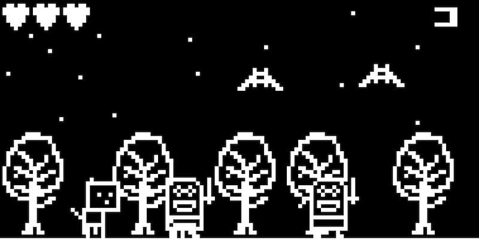

Mitty The Kitty: Arduboy 2d game
==

(c) 2023 Gavin Davies, "Bean" Davies and "Button" Davies

My kids (5 and 4 at the time) designed this game and did most of the sprite work. I've withheld their names for their privacy but it was fun to work on this project with them!

This is a simple platform game for the Arduboy platform. Can you guide Mitty the Kitty past obstacles and enemies to beat all 8 levels? A "duff" is "Bean"'s parlance for hitting something! Mitty is one of my kids' cat teddies.

Playing on an emulator
--

[Play Mitty the Kitty on the ProjectABE emulator](https://felipemanga.github.io/ProjectABE/?url=https://github.com/gavD/mitty_the_kitty/raw/main/build/arduino.avr.leonardo/mitty_the_kitty.ino.hex&skin=BareFit&Color=FFFFFF)

Controls:
- Arrow keys: move
- A: jump
- B: duff

How do I play this on a _real_ Arduboy?
--

First, buy or build an Arduboy. There's some kits, but I found the real deal to be more reliable (USBs shear off Arduino Leonardos SO easily, so the one I built was bunk!).

Then, here are some docs to get you started transferring Mitty the Kitty to your Arduboy:

- https://community.arduboy.com/t/how-to-add-games-to-an-arduboy/1423
- https://community.arduboy.com/t/how-do-i-install-a-game-on-arduboy/4798
- https://www.instructables.com/How-to-Upload-Games-to-Arduboy-and-500-Games-to-Fl/

Plaforms
--

Developed on Mac and Windows in [Arduino IDE](https://www.arduino.cc/en/software) using an [Arduboy FX](https://www.arduboy.com/shop/p/arduboy-fx) (I bought one from CoolComponents after the one I built myself failed with a sheared USB socket on the Leonardo board).

Target platform: [Arduboy](https://www.arduboy.com/)

Why did you commit binaries, do you no git gud?
--

Well, I MOSTLY git gud, [read my book on Git if you like](https://gavd.co.uk/2021/09/book-git-workflow-discipline/).

The binaries are committed to make it easier to play it on an emulator - it's simple hosting without faffing around. This is a hobby; I'm on a tight timescale as a parent of small kids!

Although if there's a nigh-zero effort better way to publish a binary that I can easily update, lemme know!

Mapping of positions to pixels
--

Some objects in the game have x,y positions that are uint16_t rather than integer positions that correspond to pixels. This is because the game runs at 60fps and you can't render sprites at a subpixel location (AFAIK! This is my first non-trivial Arduboy game! There's likely a better way). So, we store x,y at higher resolution then use a multiplier to map between positions and pixel locations. This allows objects to move at different rates (e.g. Mitty is faster than the squirrel, and the bird is faster than Mitty)

License
--

Public domain
